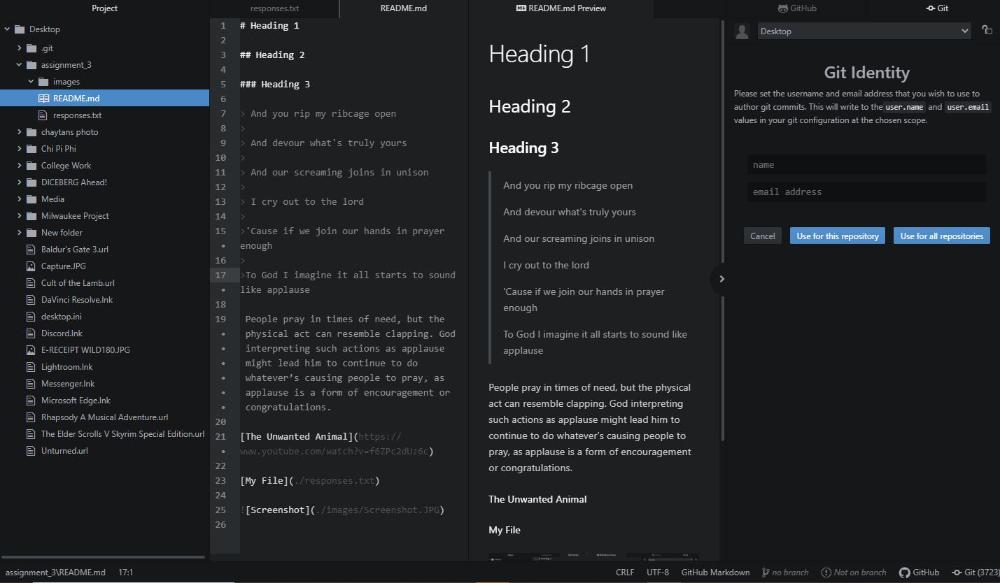

# Heading 1

## Heading 2

### Heading 3

> And you rip my ribcage open
>
> And devour what's truly yours
>
> And our screaming joins in unison
>
> I cry out to the lord
>
>'Cause if we join our hands in prayer enough
>
>To God I imagine it all starts to sound like applause

 People pray in times of need, but the physical act can resemble clapping. God interpreting such actions as applause might lead him to continue to do whatever’s causing people to pray, as applause is a form of encouragement or congratulations.

[The Unwanted Animal](https://www.youtube.com/watch?v=f6ZPc2dUz6c)

[My File](./responses.txt)

